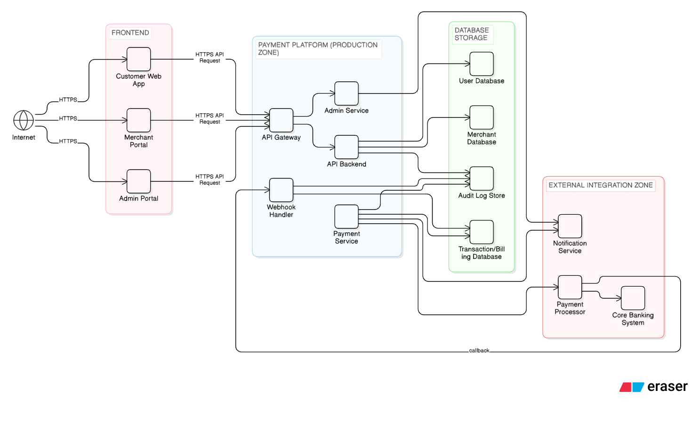
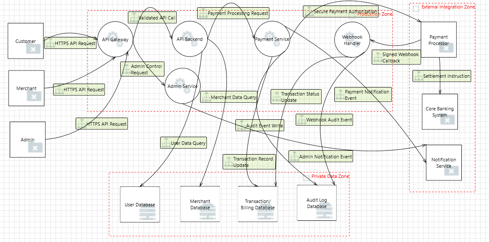

# Secure Architecture and STRIDE-Based Threat Modeling of an Online Payment Processing Application
## Task 1. System Definition and Architecture 
### System Overview
This system helps customers pay merchants online in a way. It allows for payment checks, refunds and handling problems with payments. It also helps with getting payments settled with banks.

The design is layered. Can work with different cloud systems. It connects with a payment processor and a core banking system. The platform deals with money and personal info so it is built to make sure:
- Confidentiality (protection of sensitive data)
- Integrity (accurate transaction processing)
- Availability (continuous payment operations)
- Accountability (auditability of financial actions)

Both external threats (internet-based attacks) and insider threats (misuse of administrative privileges) are considered in the architecture.

### Application Components
**Frontend**
- Customer Web Application (checkout, order history, payment status)
- Merchant Portal (transaction viewing, refund requests, settlement reports)
- Admin Portal (refund approvals, dispute handling, monitoring dashboards)

All frontend applications communicate with backend services over HTTPS.

**Backend Services**
- API Gateway (authentication, authorization, rate limiting, request validation, entry point for all external traffic)
- API Backend (business logic, order management, validation rules)
- Payment Service (payment orchestration, token handling, communication with payment processor)
- Webhook Handler (receives payment confirmation callbacks, updates transaction state)
- Admin Service (refund approvals, dispute handling, financial adjustments)

**Data Storage (Private Zone)**

All databases are located in a restricted internal network zone.
- User Database (customer accounts, credentials)
- Merchant Database (merchant profiles, API credentials)
- Transaction/Billing Database (orders, payments, refunds records, settlement details)
- Audit Log Store (immutable logs, security events, administrative actions)

**External Integrations**
- Payment Processor API (authorization, capture, tokenization, payment confirmation callbacks)
- Core Banking System (settlement and reconciliation)
- Notification Service (email/SMS alerts)

**Admin Access Paths**
- Admin Portal accessible only through VPN
- Multi-factor authentication required
- Separate privilege plane from customer APIs
- Strict role-based access control

### Users and Roles
| Role                 | Description |
|----------------------|-------------|
| Customer             | Uses the Customer Web App to initiate payments and view order history. |
| Merchant             | Uses the Merchant Portal to view transactions and request refunds. |
| Application Admin    | Uses the Admin Portal to manage operational tasks through the Admin Service. |
| System Administrator | Manages infrastructure, CI/CD pipeline, deployment approvals, and security services. |
| External Attacker    | Internet-based adversary attempting to exploit public-facing components. |
| Insider Threat       | Malicious or compromised internal user with legitimate access. |

Administrative roles have elevated access and require additional controls.

### Data Types Handled
| Data Type               | Sensitivity Level        |
|-------------------------|--------------------------|
| Credit Card Data        | 🔴 Highly Sensitive       |
| Payment Tokens          | 🔴 Highly Sensitive       |
| Customer Personal Data  | 🟡 Sensitive              |
| Merchant Credentials    | 🔴 Highly Sensitive       |
| Transaction Records     | 🟡 Sensitive              |
| JWT / Session Tokens    | 🟡 Sensitive              |
| Audit Logs              | 🟠 Moderate to Sensitive  |

### High-Level Architecture Diagram (Logical View)
Below is the logical architecture of the system:

### Trust Boundaries
| Boundary ID | Between | Boundary Type | Description | Reasoning |
|-------------|----------|--------------|-------------|-----------|
| TB1 | Internet ↔ API Gateway | External Network Boundary | Separates untrusted public internet traffic from internal production services. All external requests must pass through the API Gateway. | Prevents direct access to backend systems and enforces authentication and validation at the entry point. |
| TB2 | Frontend ↔ Backend Services | Application Layer Boundary | Frontend applications (Customer, Merchant, Admin portals) communicate with backend services only via the API Gateway. | Prevents direct database access and maintains separation between presentation and business logic layers. |
| TB3 | Admin Portal ↔ Admin Service | Privilege Boundary | Administrative actions (refund approvals, dispute handling, financial adjustments) occur through a dedicated service layer. | Administrative roles have elevated privileges and can impact financial integrity. |
| TB4 | Backend Services ↔ Data Storage | Data Storage Boundary | Databases are located in a restricted internal zone accessible only by backend services. | Protects sensitive information such as credentials, tokens, and transaction data from unauthorized access. |
| TB5 | Production Zone ↔ Payment Processor | Third-Party / External System Boundary | Communication between internal Payment Service and external Payment Processor API occurs across organizational boundaries. | External systems are not under direct control and introduce integration risk. |
| TB6 | Payment Processor ↔ Webhook Handler | External Callback Boundary | The Webhook Handler receives inbound payment confirmation callbacks from the Payment Processor. | Represents a secondary external entry point that must validate inbound data before updating transactions. |

## Task 2. Asset Identification and Security Objectives 
### Asset Inventory Table
| Asset ID | Asset Name | Category | Description | Location | Sensitivity |
|----------|------------|----------|-------------|----------|------------|
| A1 | User Credentials | Credentials | Customer login data (username, hashed password) | User Database | High |
| A2 | Merchant API Credentials | Credentials | API keys and authentication data used by merchants | Merchant Database | High |
| A3 | Admin Credentials | Credentials | Administrative login credentials and session tokens | User Database | High |
| A4 | Credit Card Data | Financial Data | Card number, expiry, CVV (processed via payment service) | Payment Service / Transaction DB | Critical |
| A5 | Payment Tokens | Financial Data | Tokenized representation of card data | Payment Service | High |
| A6 | Transaction Records | Financial Data | Orders, payments, refunds, settlement data | Transaction/Billing Database | High |
| A7 | Customer Personal Data | Personal Data | Name, email, phone, billing address | User Database | Medium |
| A8 | Merchant Profile Data | Business Data | Merchant details, settlement preferences | Merchant Database | Medium |
| A9 | Business Logic | Application Logic | Order validation, refund logic, settlement rules | API Backend / Admin Service | High |
| A10 | Audit Logs | Logging Data | Immutable records of admin actions and system events | Audit Log Store | High |
| A11 | JWT / Session Tokens | Authentication Data | Session identifiers used for user authentication | API Gateway | High |
| A12 | Payment Processor API Contract | External Integration | Communication interface with third-party processor | Payment Service | High |

### Mapping of Assets to Security Objectives (CIAA)
| Asset ID | Asset Name | Confidentiality | Integrity | Availability | Accountability |
|----------|------------|----------------|-----------|-------------|---------------|
| A1 | User Credentials |  Required |  Required |  Required |  Required |
| A2 | Merchant API Credentials |  Required |  Required |  Required |  Required |
| A3 | Admin Credentials |  Required |  Required |  Required |  Required |
| A4 | Credit Card Data |  Critical |  Critical |  Required |  Required |
| A5 | Payment Tokens |  Critical |  Required |  Required |  Required |
| A6 | Transaction Records |  Required |  Critical |  Critical |  Required |
| A7 | Customer Personal Data |  Required |  Required |  Required | Optional |
| A8 | Merchant Profile Data |  Required |  Required |  Required | Optional |
| A9 | Business Logic |  Required |  Critical |  Critical | Optional |
| A10 | Audit Logs |  Required |  Critical |  Required |  Critical |
| A11 | JWT / Session Tokens |  Critical |  Required |  Required |  Required |
| A12 | Payment Processor API Contract |  Required |  Critical |  Critical | Optional |

## Task 3. Threat Modeling

### Threat diagram - STRIDE

### Threat Model Table
| ID | Threat Area | STRIDE Category | Affected Component | Threat Title | Description | Impact | Risk Level | Risk Reasoning |
|----|------------|----------------|-------------------|--------------|-------------|--------|------------|---------------|
| 124 | Authentication | Spoofing | Customer (External Entity) | Spoofing the Customer External Entity | Customer may be spoofed by an attacker and this may allow unauthorized access to the system. | Unauthorized access to customer accounts and payment actions. | High | Internet-facing authentication entry point; identity compromise leads to financial fraud. |
| 1 | Authorization | Elevation Of Privilege | API Gateway | Elevation Using Impersonation | API Gateway may be able to impersonate the consumer. | Privilege escalation allowing broader API access. | High | Gateway enforces authentication and routing; impersonation compromises trust boundary. |
| 2 | Authentication | Spoofing | Merchant (External Entity) | Spoofing the Merchant External Entity | Merchant may be spoofed by an attacker and this may allow unauthorized access. | Fraudulent merchant actions such as refunds or settlements. | High | Merchant APIs interact with financial systems; spoofing directly affects revenue integrity. |
| 4 | Administrative Access | Spoofing | Admin (External Entity) | Spoofing the Admin External Entity | Admin may be spoofed by an attacker and this may allow unauthorized administrative control. | Full system control or configuration manipulation. | High | Admin has highest privilege; compromise impacts all zones. |
| 5 | Authorization | Elevation Of Privilege | API Gateway | Elevation Using Impersonation | API Gateway may be able to impersonate the consumer. | Token misuse or bypass of access control. | High | Privilege escalation at gateway affects backend services. |
| 8 | Authorization | Elevation Of Privilege | Payment Service | Elevation Using Impersonation | Payment Service may be able to impersonate the consumer. | Unauthorized payment processing actions. | High | Payment service handles transaction lifecycle; impersonation impacts financial integrity. |
| 13 | Data Storage | Spoofing | Transaction/Billing Database | Spoofing of Destination Data Store Transaction/Billing Database | Transaction/Billing Database may be spoofed by an attacker. | Financial record manipulation. | High | Transaction data integrity is critical to business operations. |
| 10 | API Communication | Denial Of Service | API Backend / User Database | Potential Excessive Resource Consumption for API Backend or User Database | Does API Backend or User Database take explicit steps to control resource consumption? | Service degradation or crash. | High | Resource exhaustion affects system availability. |
| 16 | Logging and Monitoring | Denial Of Service | Payment Service / Audit Log Database | Potential Excessive Resource Consumption for Payment Service or Audit Log Database | Does Payment Service or Audit Log Database take explicit steps to control resource consumption? | Logging failure or delayed audit capture. | High | Audit reliability is required for compliance and forensic analysis. |
| 18 | API Communication | Elevation Of Privilege | Webhook Handler | Elevation Using Impersonation | Webhook Handler may be able to impersonate the consumer. | Forged webhook events affecting transaction status. | High | Webhooks influence settlement confirmation; impersonation enables fraud. |
| 19 | Data Storage | Spoofing | Transaction/Billing Database | Spoofing of Destination Data Store Transaction/Billing Database | Transaction/Billing Database may be spoofed by an attacker. | Unauthorized transaction status manipulation. | High | Database spoofing breaks core trust boundary in Private Data Zone. |
| 20 | API Communication | Denial Of Service | Webhook Handler / Transaction/Billing Database | Potential Excessive Resource Consumption for Webhook Handler or Transaction/Billing Database | Does Webhook Handler or Transaction/Billing Database take explicit steps to control resource consumption? | Delayed payment confirmation and settlement failures. | High | Payment lifecycle depends on reliable webhook processing. |

The complete threat model and role-to-threat mapping table is available in the full threat register:

**Full Threat Model Table:**  
https://docs.google.com/spreadsheets/d/19GUuT_pfeCqj_SygqRstEMSVBlQKtaSB6fgJTf5cnRs/edit?usp=sharing

## Task 4. Secure Architecture Design 

### Identity and Access Management
- **User IdP (OIDC/OAuth2)** centralizes login and token issuance for customers and merchants. This reduces identity spoofing risk and standardizes authentication.
- **Admin IdP (MFA)** enforces stronger authentication for administrative access because admin compromise has the highest impact.
- **RBAC/ABAC Policy Engine** ensures authorization is applied consistently across services and prevents privilege escalation or role bypass.

### Network Segmentation
- **WAF at the public edge** filters malicious traffic before it reaches core services.
- **Private Services Zone** ensures backend services are not directly reachable from the internet.
- **Private Data Zone** isolates databases so they are only accessible from backend services.
- **Admin Plane separation (VPN → Admin Portal → Admin Service)** isolates administrative operations from the customer/merchant plane.

### Data Protection
- **TLS/HTTPS for client traffic and mTLS to payment processor** protects confidentiality and integrity of API communications.
- **KMS/HSM encryption at rest** protects sensitive stored data in databases and logs.
- **Immutable/WORM audit log store** prevents tampering and supports compliance, investigations, and non-repudiation.

### Secrets Management
- **Secrets Manager** stores and rotates credentials (DB creds, API keys, processor secrets) so they are not embedded in services or source code.

### Monitoring and Logging
- **Central Logging/SIEM** collects logs from gateway and services for detection and alerting.
- **Audit log pipeline** ensures admin actions and payment events are recorded for accountability.

### Secure Deployment Practices
- **CI/CD security scans (SAST, dependency, image scans)** reduce the chance of deploying vulnerable builds.
- **IaC policy checks** reduce misconfiguration risk in production.
- **Signed artifacts + approval gate** provide deployment integrity and reduce the risk of unauthorized changes, especially in the admin plane.

### Defense-in-Depth Summary
Security controls were added at multiple layers: edge (WAF), identity (IdP + MFA), authorization (RBAC/ABAC), network (segmentation + admin plane), data (encryption + immutable logs), operations (SIEM), and deployment (secure CI/CD). This ensures no single control failure compromises the full system.

## Task 5. Risk Treatment and Residual Risk 
### Risk Treatment Table
| Threat ID | Threat Title | Risk Level | Treatment Decision | Rationale | Residual Risk |
|------------|-------------|------------|-------------------|------------|---------------|
| 0 | Spoofing the Customer External Entity | High | Mitigate | Implement OIDC authentication, token validation, TLS, and WAF protections. | Residual risk remains due to possible credential theft or phishing outside system control. |
| 1 | Elevation Using Impersonation (API Gateway) | High | Mitigate | Enforce token validation, RBAC/ABAC authorization, and gateway-level access control. | Misconfiguration risk remains if policies are incorrectly defined. |
| 2 | Spoofing the Merchant External Entity | High | Mitigate | Use centralized authentication and signed API tokens for merchant requests. | Residual phishing or credential compromise risk remains externally. |
| 4 | Spoofing the Admin External Entity | High | Mitigate | Enforce VPN + MFA + separate admin identity provider. | Insider threat or stolen MFA device risk remains. |
| 5 | Spoofing of User Database | High | Mitigate | Restrict DB access to private subnet + TLS + KMS encryption. | Residual risk if internal network compromise occurs. |
| 8 | Spoofing of Transaction/Billing Database | High | Mitigate | Private Data Zone + encryption at rest + strict service identity controls. | Risk remains in case of privileged insider abuse. |
| 10 | Spoofing of Audit Log Database | High | Mitigate | Immutable/WORM audit storage + SIEM monitoring. | Residual risk if storage provider itself is compromised. |
| 16 | Lack of Input Validation at API Gateway | High | Mitigate | WAF + gateway validation + strict request schema enforcement. | Zero-day input bypass techniques may still exist. |
| 18 | Data Repudiation at API Gateway | High | Mitigate | Centralized logging + immutable logs + admin action tracing. | Logging gaps due to misconfiguration may persist. |
| 19 | Data Flow Sniffing | High | Mitigate | TLS for all communications + mTLS for payment processor integration. | TLS misconfiguration risk remains. |
| 20 | API Gateway Denial of Service | High | Mitigate + Transfer | Use WAF rate limiting + cloud DDoS protection (transfer to cloud provider). | Large-scale volumetric DDoS may still degrade performance. |
| 13 | Webhook Handler Resource Exhaustion | High | Mitigate | Rate limiting + resource quotas + autoscaling. | Extreme traffic spikes may still cause delays. |

#### Primary Residual Risk Drivers

1. **Human and behavioral risk** – User behavior, social engineering, and administrative misuse remain outside complete technical control.
2. **Configuration and operational risk** – Security mechanisms such as RBAC, logging, and network policies require ongoing maintenance and may degrade if misconfigured.
3. **Third-party dependency risk** – The system depends on external payment processors and cloud infrastructure providers whose internal controls are not fully visible.
4. **Advanced or unknown threats** – Zero-day vulnerabilities and novel attack techniques may bypass layered defenses.

Residual risk is reduced to an acceptable operational level through defense-in-depth, continuous monitoring, and separation of privilege domains, but it cannot be eliminated entirely.

## Assumptions and Limitations

### Assumptions

The following assumptions were made during the design and threat modeling process:

1. **Cloud Infrastructure Reliability**  
   The underlying cloud infrastructure provider is assumed to provide secure physical data centers, network isolation, and baseline DDoS protection.
2. **Secure Payment Processor**  
   The external payment processor and core banking system are assumed to follow industry security standards and properly validate and sign callbacks (webhooks).
3. **TLS Configuration is Properly Implemented**  
   All external and internal communications are assumed to use correctly configured TLS with valid certificates.
4. **Secure Key and Secret Storage**  
   The Secrets Manager and KMS/HSM systems are assumed to be properly configured, access-controlled, and monitored.
5. **Users Follow Security Best Practices**  
   End users (customers, merchants, administrators) are assumed to protect their credentials and devices to a reasonable extent.
6. **Administrative Controls Are Enforced**  
   VPN access, MFA enforcement, RBAC policies, and approval gates are assumed to be correctly implemented and maintained.
7. **Compliance Requirements Are Followed**  
   Industry compliance standards (e.g., PCI DSS where applicable) are assumed to be followed for handling financial data.

---

### Limitations

The threat model and architecture design have the following limitations:

1. **High-Level Architectural Scope**  
   The analysis focuses on architectural controls rather than detailed code-level vulnerabilities.
2. **No Full Infrastructure Deep Dive**  
   Low-level infrastructure components such as load balancers, container orchestration details, or operating system hardening were not modeled in depth.
3. **Third-Party Systems Outside Direct Control**  
   External services (payment processor, cloud provider, notification provider) are outside the system’s direct security control.
4. **Zero-Day and Advanced Persistent Threats**  
   Unknown vulnerabilities and highly sophisticated attackers may bypass implemented defenses.
5. **Human Behavior Unpredictability**  
   Insider threats and social engineering attacks cannot be fully eliminated through technical controls.
6. **Operational Security Dependency**  
   Security effectiveness depends on proper monitoring, alert response, and regular maintenance of controls.
7. **Simplified Trust Boundary Representation**  
   The trust boundaries shown in the diagram are conceptual and may differ in a real production deployment environment.

---

Despite these limitations, the proposed architecture significantly reduces the likelihood and impact of high-risk threats through layered security controls and defense-in-depth design principles.

