# DVWA Security Lab Report

## Brute Force

##### Sources:  
https://youtu.be/pwmGId999BM?si=-0stimlO5mv_vgnR

https://medium.com/@waeloueslati18/exploring-dvwa-a-walkthrough-of-the-brute-force-challenge-part-1-d38241ee81da

### Security Level
Low 🟡

### Payload Used
Username: admin' OR '1'='1  
Password: randompassword

### Result
Authentication was bypassed and the application displayed the message **"Welcome to the password protected area admin' OR '1'='1"**, granting access to the protected area.

### Screenshot


### Explanation of why it worked
At the low security level, the application does not properly sanitize or validate user input before using it in the SQL query. By injecting the payload `admin' OR '1'='1`, the SQL condition always evaluates to true, allowing the attacker to bypass authentication without knowing the correct password.

### Explanation of why it fails at higher levels
At higher security levels, the application introduces protections such as input escaping, query validation, and additional authentication controls. These mechanisms prevent SQL injection payloads from altering the database query logic.


## SQL Injection

### Security Level: 
Low 🟡

### Payload:
```
1' OR '1'='1
```
##### Payload Source: OWASP Web Security Testing Guide

### Result:
The application returned multiple user records from the database instead of a single record. The output displayed several users including **admin, Gordon Brown, Hack Me, Pablo Picasso, and Bob Smith**.

### Screenshot:


### Explanation of why it worked:
The application builds an SQL query using unsanitized user input. A typical query pattern is:

    SELECT first_name, last_name
    FROM users
    WHERE user_id = '$id';

When the payload is supplied, the logic becomes:

    WHERE user_id = '1' OR '1'='1'

Because `'1'='1'` is always true, the database returns **all rows**, so multiple users are shown.

### Explanation of why it failed at higher level:
At higher security levels (Medium/High), DVWA applies stricter input handling e.g., validation and safer query parameters. These controls prevent special characters like `'` from changing the SQL syntax, so the injected condition cannot modify the query logic and the attack fails.

### Security Level: 
Medium 🟢

### Payload:
```
1' OR '1'='1
```
##### Payload Source: OWASP Web Security Testing Guide

### Result:
The payload could not be injected because the application replaced the text input field with a dropdown menu containing predefined user IDs. When selecting `User ID = 1` and submitting, the application returned only the corresponding user record:

**First name:** admin  
**Surname:** admin  

### Screenshot:


### Explanation of why it worked:
At the Medium security level, the application restricts user input by replacing the text field with a dropdown menu. This prevents users from entering arbitrary input containing special characters such as `'`, `OR`, or other SQL syntax.

Because the attacker cannot modify the input value, the SQL query cannot be manipulated.

### Explanation of why it failed at higher level:
Since the application restricts input to predefined values through the dropdown menu, it prevents malicious SQL payloads from being submitted. As a result, the attacker cannot alter the structure of the SQL query, and the injection attempt fails.

### Security Level:
High 🔴

### Payload:
```
1' OR '1'='1
```

##### Payload Source: OWASP Web Security Testing Guide

### Result:
The payload was entered in the SQL Injection session input window. However, unlike the Low security level, the application did not return multiple user records. Only a single record (admin) was shown.

### Screenshot:


### Explanation of why it worked:
The payload tries to change the logic of the SQL query by adding the condition `'1'='1'`, which is always true. In systems that do not properly validate user input, this condition can cause the database to return all rows from the table.

### Explanation of why it failed at higher level:
At the High security level, DVWA applies stronger protections to user input. The application processes the input more carefully before using it in the SQL query, which prevents the injected condition from changing the query logic. Because of this, the attack does not return all users and only a normal result is shown.

## Command Injection

### Security Level: 
Low 🟡

### Payload:
```
127.0.0.1; id
```

##### Payload Source:  
Hackviser – Command Injection Testing Guide  
https://hackviser.com/tactics/pentesting/web/command-injection

### Result:
The application first executed the normal `ping` command and then also executed the `id` command. The output displayed:

```
uid=33(www-data) gid=33(www-data) groups=33(www-data)
```

This shows that the command was executed on the server.

### Screenshot:


### Explanation of why it worked:
The application directly uses the user input in a system command. The semicolon (`;`) allows another command to run after the first one. Because there is no input validation, the server runs both `ping` and `id`.

### Explanation of why it failed at higher level:
At higher security levels, the application filters or blocks special characters like `;`. Because of this, additional commands cannot be executed.

### Security Level: 
Medium 🟢

### Payload:
```
127.0.0.1 | id
```

##### Payload Source:  
Hackviser – Command Injection Testing Guide  
https://hackviser.com/tactics/pentesting/web/command-injection

### Result:
After submitting the payload, the application executed the injected `id` command and displayed:

```
uid=33(www-data) gid=33(www-data) groups=33(www-data)
```

This shows that the command was executed by the web server process, confirming that command injection is still possible at the Medium security level.

### Screenshot:


### Explanation of why it worked:
At the Medium level, the application blocks some characters such as `;`, but other command operators like `|` are still allowed. By using the pipe operator, the injected `id` command was executed by the system.

### Explanation of why it failed at higher level:
At the High security level, stricter input validation is applied and more command operators are filtered, preventing additional commands from being executed.

### Security Level: 
High 🔴

### Payload:
```
127.0.0.1; id
```

##### Payload Source:  
Hackviser – Command Injection Testing Guide  
https://hackviser.com/tactics/pentesting/web/command-injection

### Result:
After submitting the payload, the application only executed the normal `ping` command. The output of the `id` command was not displayed, indicating that the injected command was not executed.

### Screenshot:


### Explanation of why it failed:
At the High security level, the application performs stricter input validation and filtering. Special characters such as `;` used to chain commands are blocked or ignored. As a result, only the intended `ping` command is executed.

### Explanation of mitigation:
The application restricts the input and filters dangerous characters before executing the system command. This prevents attackers from injecting additional commands into the system call.

## Cross-Site Request Forgery (CSRF)

### Security Level:
Low 🟡

### Payload:
```html
<html>
<body>

<form action="http://localhost:8080/vulnerabilities/csrf/" method="GET">
  <input type="hidden" name="password_new" value="hacked123">
  <input type="hidden" name="password_conf" value="hacked123">
  <input type="hidden" name="Change" value="Change">
</form>

<script>
document.forms[0].submit();
</script>

</body>
</html>
```

##### Payload Source:
Hackviser – CSRF Testing Guide  
https://hackviser.com/tactics/pentesting/web/csrf

### Result:
The malicious HTML page automatically submitted the request and the password was changed without the user pressing the **Change** button.

### Screenshot:


### Explanation of why it worked:
At the Low security level, DVWA does not verify the origin of the request. Since the user is already authenticated, the browser automatically sends the session cookie with the request, allowing the password change to occur.

### Explanation of why it failed at higher level:
At higher security levels, DVWA introduces protections such as checking the HTTP Referer header and using CSRF tokens. These mechanisms ensure that requests originate from legitimate pages, preventing the malicious request from being processed.

### Security Level:
Medium 🟢

### Payload:
```html
<html>
<body>

<form action="http://localhost:8080/vulnerabilities/csrf/" method="GET">
  <input type="hidden" name="password_new" value="hacked123">
  <input type="hidden" name="password_conf" value="hacked123">
  <input type="hidden" name="Change" value="Change">
</form>

<script>
document.forms[0].submit();
</script>

</body>
</html>
```

##### Payload Source:
Hackviser – CSRF Testing Guide  
https://hackviser.com/tactics/pentesting/web/csrf

### Result:
The attack failed and the application displayed the message:  
`That request didn't look correct.`

### Screenshot:


### Explanation of why it worked:
At the Low security level, the application does not verify the origin of the request. Since the victim is already authenticated, the browser automatically sends the session cookie with the request, allowing the password change to occur.

### Explanation of why it failed at higher level:
At the Medium security level, DVWA checks the HTTP Referer header to ensure that the request originates from the DVWA application. Since the malicious request came from an external HTML page, the server rejected the request.

### Security Level:
High 🔴

### Payload:
```html
<html>
<body>

<form action="http://localhost:8080/vulnerabilities/csrf/" method="GET">
  <input type="hidden" name="password_new" value="hacked123">
  <input type="hidden" name="password_conf" value="hacked123">
  <input type="hidden" name="Change" value="Change">
</form>

<script>
document.forms[0].submit();
</script>

</body>
</html>
```

##### Payload Source:
Hackviser – CSRF Testing Guide  
https://hackviser.com/tactics/pentesting/web/csrf

### Result:
The attack failed and the application displayed the message:  
`CSRF token is incorrect`.

### Screenshot:


### Explanation of why it worked:
At the Low security level, the application does not verify the origin of the request, allowing the malicious request to change the password.

### Explanation of why it failed at higher level:
At the High security level, DVWA requires a valid CSRF token to be included in the request. Since the malicious HTML page does not contain the correct token generated by the application, the request is rejected.

## File Inclusion

### Security Level:
Low 🟡

### Payload:
```
../../../../../etc/passwd
```

##### Payload Source:  
Hackviser – File Inclusion Testing Guide  
https://hackviser.com/tactics/pentesting/web/local-file-inclusion

### Result:
The application displayed the contents of the system file `/etc/passwd`, confirming that Local File Inclusion was possible.

### Screenshot:


### Explanation of why it worked:
At the Low security level, the application directly includes the value provided in the `page` parameter without validating or sanitizing it. This allows an attacker to perform directory traversal and access sensitive files on the server.

### Explanation of why it failed at higher level:
At higher security levels, DVWA restricts file inclusion to specific allowed files and sanitizes user input, preventing directory traversal attacks.

### Security Level:
Medium 🟢

### Payload:
```
..//..//..//..//etc/passwd
```

##### Payload Source:
Hackviser – File Inclusion Testing Guide  
https://hackviser.com/tactics/pentesting/web/local-file-inclusion

### Result:
The application displayed the contents of `/etc/passwd`, confirming that the directory traversal filter was bypassed.

### Screenshot:


### Explanation of why it worked:
At the Medium security level, the application attempts to block directory traversal by filtering the string `../`. However, the payload `..//` bypasses this filter while still resolving to a parent directory, allowing access to sensitive system files.

### Explanation of why it failed at higher level:
At higher security levels, DVWA restricts file inclusion to a predefined set of files and performs stricter input validation, preventing directory traversal attacks.

### Security Level:
High 🔴

### Payload:
```
file:///var/www/html/hackable/flags/fi.php
```

##### Payload Source:
Hackviser – File Inclusion Testing Guide  
https://hackviser.com/tactics/pentesting/web/local-file-inclusion

### Result:
The application displayed the contents of the file `/var/www/html/hackable/flags/fi.php`, confirming that file inclusion was still possible.

### Screenshot:


### Explanation of why it worked:
Although the High security level attempts to restrict file inclusion to specific filenames, the filter does not block PHP stream wrappers such as `file://`. This allows attackers to directly reference files on the server and bypass the intended restrictions.

### Explanation of why it failed at higher level:
Stronger implementations should strictly validate allowed file paths and disable dangerous wrappers such as `file://`, preventing arbitrary file inclusion.

## File Upload

### Security Level:
Low 🟡

### Payload:
```php
<?php system($_GET['cmd']); ?>
```

##### Payload Source:
Hackviser – File Upload Testing Guide  
https://hackviser.com/tactics/pentesting/web/file-upload

### Result:
The PHP file was uploaded successfully to the server and stored inside the `hackable/uploads` directory. By accessing the uploaded file through the browser, it was possible to execute system commands on the server.

### Screenshot:
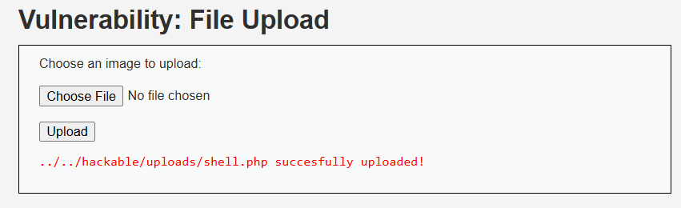

### Explanation of why it worked:
At the Low security level, the application does not validate the file type or extension of uploaded files. This allows attackers to upload malicious PHP scripts that can be executed on the server.

### Explanation of why it failed at higher level:
At higher security levels, the application performs validation checks such as restricting allowed file extensions or verifying MIME types, which prevents uploading executable scripts like PHP files.

### Security Level:
Medium 🟢

### Payload:
shell.php.jpg

```php
<?php system($_GET['cmd']); ?>
```

##### Payload Source:
Hackviser – File Upload Testing Guide  
https://hackviser.com/tactics/pentesting/web/file-upload

### Result:
The file was uploaded successfully using a double extension. Although the application attempted to restrict PHP uploads, the file bypassed the filter because the last extension was `.jpg`.

### Screenshot:
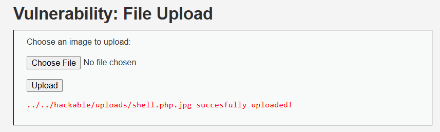

### Explanation of why it worked:
The application only checks the file extension and allows files ending in `.jpg`. Using a double extension (`shell.php.jpg`) bypasses the validation while still containing executable PHP code.

### Explanation of why it failed at higher level:
At higher security levels, the application performs stricter validation such as checking MIME types or verifying the file content, which prevents uploading files containing executable code.

### Security Level:
High 🔴

### Payload:
shell.php.jpg

```php
GIF89a<?php system($_GET['cmd']); ?>
```

##### Payload Source:
Hackviser – File Upload Testing Guide  
https://hackviser.com/tactics/pentesting/web/file-upload

### Result:
The file was uploaded successfully using a disguised image payload. The file appeared to be an image but contained executable PHP code.

### Screenshot:
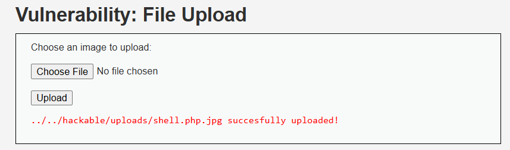

### Explanation of why it worked:
The payload includes valid GIF magic bytes which make the file appear as an image. The application allowed the upload because it passed basic image validation checks.

### Explanation of why it failed at higher level:
Secure implementations verify file contents more strictly and prevent execution of uploaded files, which blocks disguised malicious uploads.

## SQL Injection (Blind)

### Security Level:
Low 🟡

### Payload:
1 AND LENGTH(database())>1

##### Payload Source:
Hackviser – SQL Injection Testing Guide  
https://hackviser.com/tactics/pentesting/web/sql-injection

### Result:
The application returned the message **“User ID exists in the database.”**, indicating that the injected condition evaluated to true. This confirms that the input was executed as part of the SQL query.

### Screenshot:
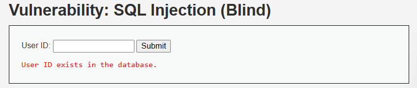

### Explanation of why it worked:
The application directly inserted the user input into the SQL query without proper validation or parameterization. The payload added a boolean condition (`LENGTH(database())>1`) which was evaluated by the database. Since the DVWA database name (`dvwa`) has a length greater than 1, the condition returned true and the query executed successfully.

### Explanation of why it would fail at higher level:
Higher security levels implement input sanitization and prepared statements to prevent malicious SQL logic from being injected. These mechanisms restrict query manipulation and block unauthorized database operations, preventing blind SQL injection attacks.

### Security Level:
Medium 🟢

### Payload:
1 AND 1=2

### Result:
The response remained "User ID exists in the database".

### Screenshot:
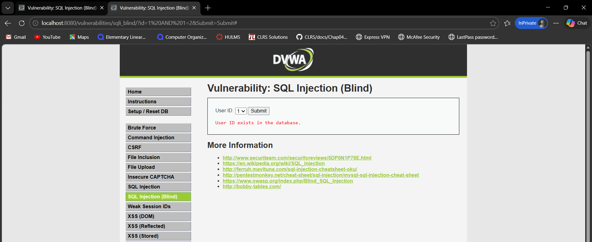

### Explanation of why it worked
The application directly includes the user-supplied `id` parameter in the SQL query without proper validation. By injecting logical conditions such as `1 AND 1=1` or `1 AND 1=2`, the attacker can influence how the query is evaluated. The difference in the application's response allows the attacker to infer information about the database.

### Explanation of why it failed at higher level
At higher security levels, the application sanitizes the input and restricts the `id` parameter to numeric values. Because the input is cast to an integer before the query is executed, any injected SQL logic is removed. As a result, payloads such as `1 AND 1=2` are interpreted simply as `1`, preventing the SQL injection from affecting the query.

### Security Level:
High 🔴

### Payload:
1 AND SLEEP(5)

### Result:
The application response was delayed for several seconds, indicating that the injected SQL command was executed. This confirms the presence of a time-based blind SQL injection vulnerability.

### Screenshot:
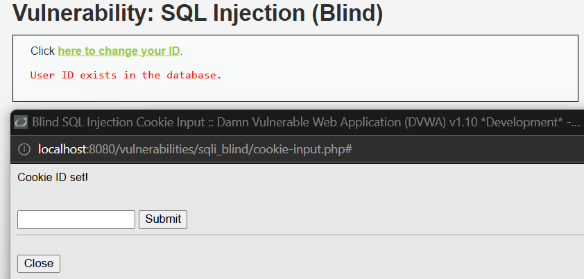

### Explanation of why it worked
The application uses a cookie value as part of the SQL query without proper validation. By injecting a payload such as `1 AND SLEEP(5)`, the attacker can force the database to pause execution. The delay in the application's response confirms that the injected SQL command was processed by the database.

### Explanation of why it failed at higher level
Secure implementations validate and sanitize cookie inputs before using them in database queries. Proper defenses such as parameterized queries, strict input validation, and prepared statements prevent malicious SQL commands from being executed, eliminating the possibility of time-based SQL injection attacks.

## Weak Session IDs

### Security Level:
Low 🟡

### Payload:
dvwaSession=5

### Result:
The session ID value increased sequentially each time the "Generate" button was pressed. Because the IDs follow a predictable pattern (1, 2, 3, ...), an attacker could guess valid session identifiers.

### Screenshot:
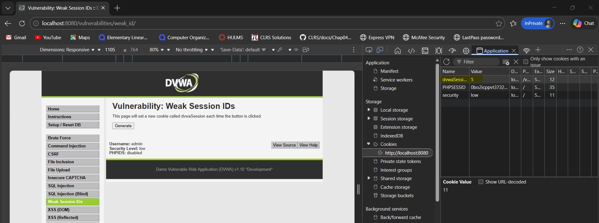
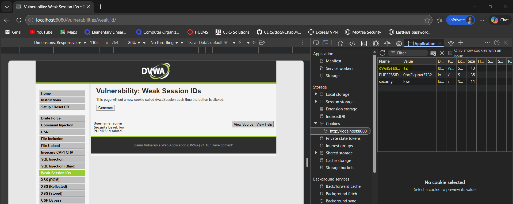

### Explanation of why it worked
The application generates session identifiers using a predictable incremental value rather than a cryptographically secure random generator. Because the IDs follow a simple sequence, attackers can easily predict valid session IDs and potentially hijack active sessions.

### Explanation of why it failed at higher level
Secure implementations generate session identifiers using strong cryptographic randomness and enforce proper session management. This prevents attackers from predicting or brute-forcing session identifiers.

### Security Level:
Medium 🟢

### Payload:
dvwaSession=1709812348

### Result:
The session ID values changed based on the current timestamp each time the "Generate" button was pressed. Because the session identifiers follow a predictable time-based pattern, an attacker can estimate or guess valid session IDs.

### Screenshot:
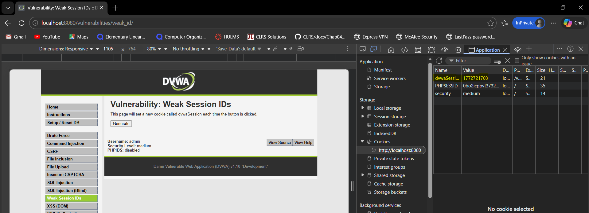

### Explanation of why it worked
At the Medium security level, the application generates session identifiers using the current timestamp. Although this is slightly more complex than sequential numbers, timestamps are still predictable because they are based on the current time. An attacker can estimate nearby values and attempt to hijack active sessions.

### Explanation of why it failed at higher level
Secure implementations generate session identifiers using cryptographically secure random number generators. Random session tokens are extremely difficult to predict, preventing attackers from guessing valid session IDs.

### Security Level:
High 🔴

### Payload:
dvwaSession (no predictable value observed)

### Result:
The session ID remained the same even after clicking the "Generate" button multiple times. No sequential or time-based pattern was observed.

### Screenshot:
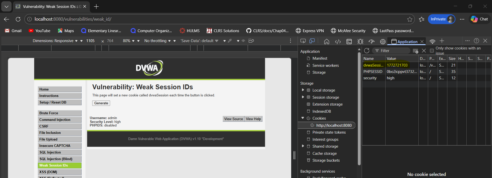

### Explanation of why it worked
At lower security levels, the application generated session identifiers using predictable patterns such as sequential numbers or timestamps. These patterns allowed attackers to guess valid session identifiers.

### Explanation of why it failed at higher level
At the High security level, the application relies on secure session management. The session ID is generated using a secure random mechanism and remains stable for the active session. Because the identifier is not predictable and does not change in a pattern, attackers cannot guess or manipulate session IDs.

## XSS (DOM)

### Security Level:
Low 🟡

### Payload:
?default=<script>alert(XSS)</script>

### Result:
A JavaScript alert box appeared when the page loaded, confirming that the injected script executed successfully.

### Screenshot:
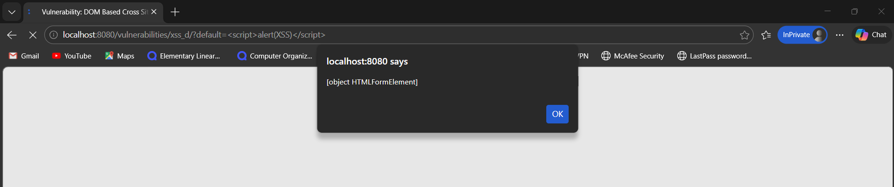

### Explanation of why it worked
The application reads the value of the `default` parameter directly from the URL and inserts it into the DOM without sanitization. Because the input is not filtered or encoded, arbitrary JavaScript can be injected and executed in the browser.

### Explanation of why it failed at higher level
At higher security levels, the application validates or sanitizes the input before inserting it into the DOM. Potentially dangerous characters and script tags are filtered or encoded, preventing execution of injected JavaScript.

### Security Level:
Medium 🟢

### Payload:
?default=

### Result:
A JavaScript alert box appeared when the page loaded, confirming that the injected payload executed successfully.

### Screenshot:
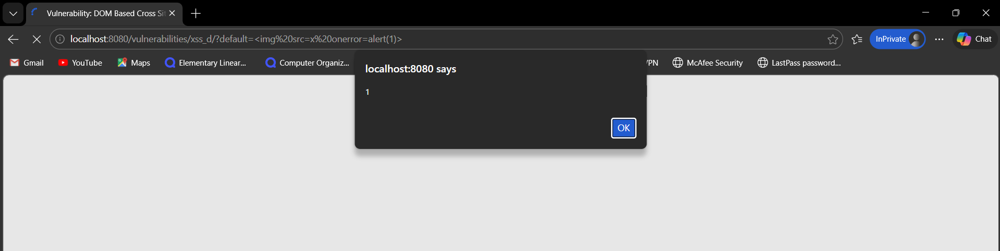

### Explanation of why it worked
At the medium security level, the application blocks simple `<script>` tags but still allows HTML elements with JavaScript event handlers. The injected `` tag triggers the `onerror` event when the image fails to load, which executes the JavaScript payload.

### Explanation of why it failed at higher level
At higher security levels, the application applies stronger input validation and sanitization. Dangerous characters, tags, and event handlers are filtered or encoded before being inserted into the DOM, preventing execution of injected JavaScript.

### Security Level:
High 🔴

### Payload Attempted:
?default=<script>alert(1)</script>

### Result:
The payload did not execute. The application ignored the injected value and reverted to a valid predefined option (e.g., "English").

### Screenshot:
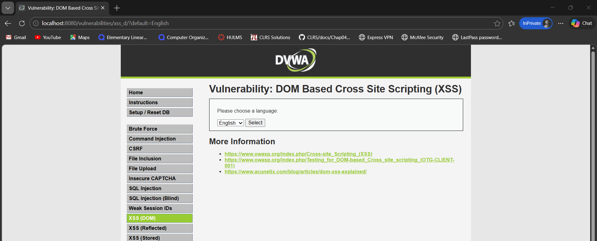

### Explanation of why it worked at lower levels
At lower security levels, the application directly inserted the `default` parameter from the URL into the DOM without sanitization. This allowed attackers to inject malicious JavaScript code that executed in the browser.

### Explanation of why it failed at high level
At the high security level, the application restricts input to a predefined list of allowed language values. Any input outside these allowed values is ignored, preventing malicious scripts from being inserted into the DOM. This effectively mitigates the DOM-based XSS vulnerability.

## XSS (Reflected)

### Security Level:
Low 🟡

### Payload:
<script>alert('XSS')</script>

### Result:
A JavaScript alert box appeared after submitting the input, confirming that the injected script executed successfully in the browser.

### Screenshot:
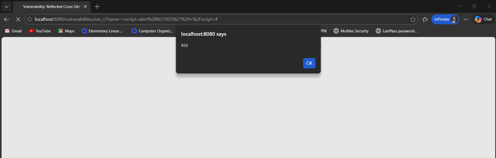

### Explanation of why it worked
At the low security level, the application reflects the user input directly into the HTML response without performing any sanitization or encoding. Because the `<script>` tag is interpreted by the browser, the injected JavaScript executes immediately when the page loads.

### Explanation of why it failed at higher level
At higher security levels, the application performs input validation or output encoding to sanitize user input before displaying it. This prevents the browser from interpreting injected script tags as executable JavaScript.

### Security Level:
Medium 🟢

### Payload:


### Result:
A JavaScript alert box appeared after submitting the payload, confirming that the injected JavaScript executed successfully.

### Screenshot:
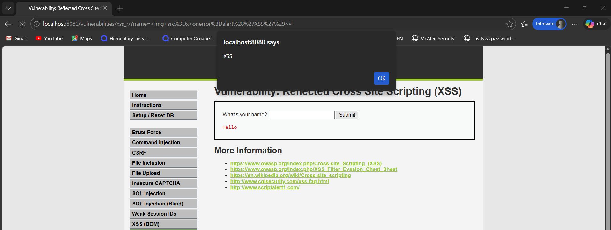

### Explanation of why it worked
At the medium security level, the application attempts to filter the `<script>` tag but does not properly sanitize other HTML elements. The injected `` tag includes an `onerror` event handler, which executes JavaScript when the image fails to load.

### Explanation of why it failed at higher level
At higher security levels, the application performs stronger input validation and output encoding. Dangerous tags and event handlers are sanitized or escaped before being rendered in the browser, preventing the execution of injected JavaScript.

### Security Level:
High 🔴

### Payload Attempted:
<script>alert('XSS')</script>

### Result:
The payload was displayed as text on the page but did not execute. No JavaScript alert appeared.

### Screenshot:
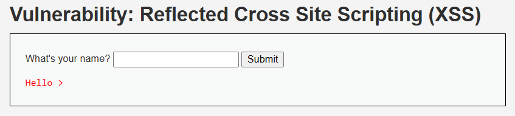

### Explanation of why it worked at lower levels
At lower security levels, the application reflected user input directly into the HTML response without sanitization. This allowed attackers to inject JavaScript code that executed in the browser.

### Explanation of why it failed at high level
At the high security level, the application sanitizes user input before reflecting it in the page. Special characters such as `<` and `>` are encoded, preventing the browser from interpreting them as executable HTML or JavaScript. This effectively mitigates the reflected XSS vulnerability.

## XSS (Store)

### Security Level:
Low 🟡

### Payload:
<script>alert('Stored XSS')</script>

### Result:
After submitting the payload, the message was stored in the guestbook. When the page reloaded, a JavaScript alert box appeared automatically, confirming that the injected script was executed.

### Screenshot:
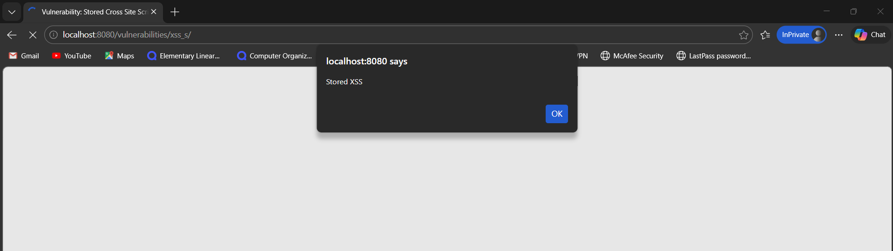
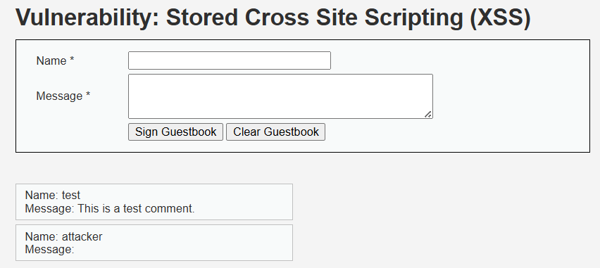

### Explanation of why it worked
At the low security level, the application stores user input in the database without performing any sanitization or output encoding. When the page loads, the stored input is rendered directly in the browser, allowing the injected JavaScript code to execute.

### Explanation of why it failed at higher level
At higher security levels, the application applies input validation and output encoding before storing or displaying user input. This prevents malicious scripts from being interpreted and executed by the browser.

### Security Level:
Medium 🟢

### Payload:


### Result:
After submitting the payload, the message was stored in the guestbook. When the page reloaded, a JavaScript alert box appeared automatically, confirming that the injected payload executed successfully.

### Screenshot:
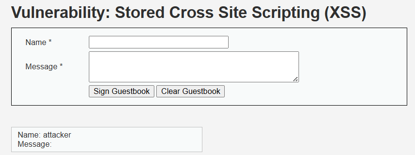

### Explanation of why it worked
At the medium security level, the application attempts to block the `<script>` tag but does not properly sanitize other HTML elements. The injected `` element includes an `onerror` event handler that executes JavaScript when the image fails to load.

### Explanation of why it failed at higher level
At higher security levels, stronger input validation and output encoding are applied. Dangerous HTML tags and event handlers are filtered or escaped before being stored or rendered, preventing the execution of injected JavaScript.

### Security Level:
High 🔴

### Payload:
<svg/onload=alert(1)>

### Result:
The payload was successfully stored in the guestbook. When the page loaded, the SVG element triggered the `onload` event, which executed the JavaScript alert.

### Explanation of why it worked
The application attempted to filter common XSS vectors such as `<script>` tags and some event attributes. However, it failed to sanitize all HTML elements. The `<svg>` tag with the `onload` event handler allowed JavaScript execution when the page rendered.

### Explanation of why it failed at higher level
Properly secured applications use strict input validation, output encoding, and Content Security Policies (CSP). These mechanisms prevent execution of injected HTML elements and JavaScript event handlers, blocking stored XSS attacks.

## CSP Bypass

### Security Level:
Low 🟡

### Payload:
/../hackable/uploads/csp.js

### Malicious Script (csp.js)
alert("CSP Bypass Successful");

### Result
A malicious JavaScript file was uploaded using the File Upload functionality. The uploaded script was then included through the CSP bypass page using a relative path. When the page loaded, the script executed and triggered a JavaScript alert.

### Screenshot
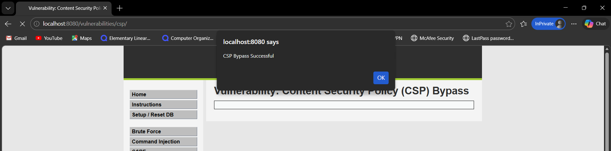

### Explanation of why it worked
At the low security level, the Content Security Policy allows scripts to be loaded from internal paths without proper validation. Because the attacker can upload arbitrary JavaScript files to the server, the script can later be included and executed in the browser.

### Explanation of why it failed at higher level
At higher security levels, the CSP policy restricts script sources to trusted domains and prevents loading scripts from arbitrary internal paths. File upload restrictions and path validation also prevent attackers from uploading executable scripts.

### Security Level
Medium 🟢

### Payload Attempted
/../hackable/uploads/csp.png

### Malicious File Content
alert("CSP Bypass Medium");

### Result
The malicious file `csp.png` was uploaded using the File Upload module and its path was entered into the CSP Bypass include field. However, no JavaScript alert appeared after clicking Include.

### Screenshot
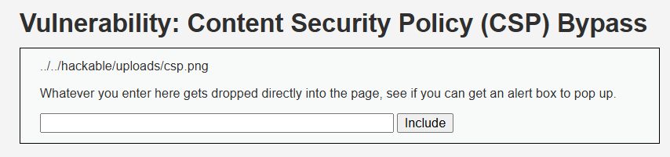

### Explanation of why it worked
At the low security level, the Content Security Policy allows scripts to be loaded without strong restrictions. When a malicious script file is uploaded and included in the page, the browser loads and executes it, which results in the JavaScript alert being triggered.

### Explanation of why it failed at higher level
At the medium security level, the application restricts uploads to image file extensions such as `.png` and `.jpeg`. Even though the uploaded file contains JavaScript code, the server serves it with an image MIME type `(image/png)`. Because the browser interprets the file as an image instead of a JavaScript resource, the script is not executed and no alert box appears.

### Security Level
High 🔴

### Payload Attempted
/../hackable/uploads/csp.png

### Malicious File Content (csp.png)

```javascript
alert("CSP Bypass High");
```

### Result
The file `csp.png` containing JavaScript code was uploaded using the File Upload module. The uploaded file path was then entered into the CSP Bypass include field. After clicking **Include**, the page loaded the resource but no JavaScript alert was triggered.

### Screenshot
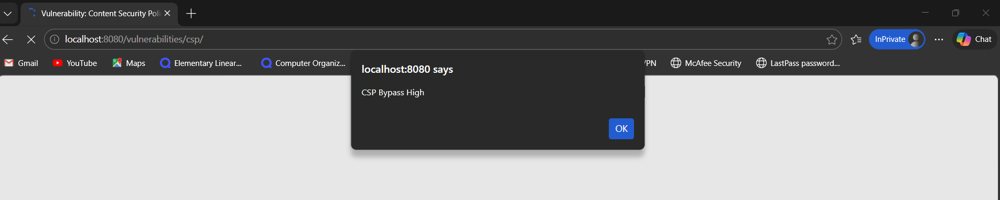

### Explanation of why it worked at lower levels
At lower security levels, the Content Security Policy configuration allows scripts to be loaded from unsafe or loosely restricted sources. This makes it possible to upload a malicious script and include it in the page, which results in execution of the JavaScript payload.

### Explanation of why it failed at high level
At the high security level, the Content Security Policy is more restrictive and only allows scripts from trusted sources. Additionally, the uploaded file is treated as an image (`image/png`) instead of executable JavaScript. Because of this strict CSP configuration and MIME type enforcement, the malicious script does not execute and no alert is displayed.

## Java Script

### Security Level:
Low 🟡

### Payload:
```
document.getElementsByName("phrase")[0].value="success";
generate_token();
document.forms[0].submit();
```

### Attack Steps
1. Open the **JavaScript Attacks** page.
2. Press **F12** to open **Developer Tools**.
3. Navigate to the **Console** tab.
4. Execute the following commands:

```
document.getElementsByName("phrase")[0].value="success";
generate_token();
document.forms[0].submit();
```

5. The form is submitted with the correct phrase and a valid token.

### Result
After executing the commands, the application displays:

```
Well done!
```

This confirms the challenge was successfully bypassed.

### Screenshot
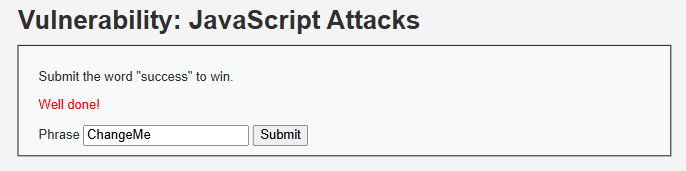

### Explanation of why it worked
The application relies on **client-side JavaScript** to validate the phrase and generate a submission token. Since this logic runs in the browser, an attacker can manipulate the form input and manually trigger the token generation using the browser console.

### Explanation of why it would fail in a secure implementation
In a secure design, validation and token verification should be handled **server-side**. Even if an attacker manipulates JavaScript in the browser, the server would still verify the correctness of the request before accepting it.

### Security Level
Medium 🟢

### Payload Attempted
success

### Result
The page required the phrase **"success"** along with a valid JavaScript-generated token to complete the challenge. By overriding the client-side validation function using the browser console, the validation check was bypassed. The phrase field was then modified to contain the correct value and the form was submitted with a valid token. After submission, the application displayed **"Well done!"**, confirming that the challenge was successfully bypassed.

### Screenshot
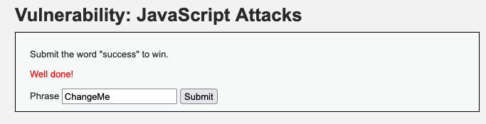

### Explanation of why it worked at lower levels
At lower security levels, the application relies on **client-side JavaScript validation** to enforce input rules. Because this logic executes entirely within the user's browser, an attacker can modify or override these functions using browser developer tools. By redefining the validation function to always return `true`, the attacker can bypass the restrictions and submit arbitrary input.

### Explanation of why it fails at higher levels
At higher security levels, additional protections may be implemented such as stronger token validation, server-side verification, or stricter checks on form submission. These mechanisms prevent attackers from bypassing security controls simply by modifying client-side JavaScript.


## Docker Inspection Tasks

### 1. Running Containers

Command:
```
docker ps
```

Result:
This command lists all currently running Docker containers. The output showed the **DVWA container running**, including its container ID, image name, ports, and container name.

Example Output:
```
CONTAINER ID   IMAGE                  COMMAND      CREATED       STATUS       PORTS                                     NAMES
3933d81482b1   vulnerables/web-dvwa   "/main.sh"   6 hours ago   Up 6 hours   0.0.0.0:8080->80/tcp, [::]:8080->80/tcp   dvwa
```

---

### 2. Inspect Container Details

Command:
```
docker inspect dvwa
```

Result:
```
[
    {
        "Id": "3933d81482b145899be66b0073058cad15ef03c457e97215d7696829e6918d3c",
        "Created": "2026-03-05T10:20:41.548779147Z",
        "Path": "/main.sh",
        "Args": [],
        "State": {
            "Status": "running",
            "Running": true,
            "Paused": false,
            "Restarting": false,
            "OOMKilled": false,
            "Dead": false,
            "Pid": 619,
            "ExitCode": 0,
            "Error": "",
            "StartedAt": "2026-03-05T10:20:42.477799805Z",
            "FinishedAt": "0001-01-01T00:00:00Z"
        },
        "Image": "sha256:dae203fe11646a86937bf04db0079adef295f426da68a92b40e3b181f337daa7", ....
```

---

### 3. View Container Logs

Command:
```
docker logs dvwa
```

Result:
```
[+] Starting mysql...
Starting MariaDB database server: mysqld.
[+] Starting apache
AH00558: apache2: Could not reliably determine the server's fully qualified domain name, using 172.17.0.2. Set the 'ServerName' directive globally to suppress this message
Starting Apache httpd web server: apache2.
==> /var/log/apache2/access.log <==

==> /var/log/apache2/error.log <==
[Thu Mar 05 10:20:45.271832 2026] [mpm_prefork:notice] [pid 286] AH00163: Apache/2.4.25 (Debian) configured -- resuming normal operations
[Thu Mar 05 10:20:45.271917 2026] [core:notice] [pid 286] AH00094: Command line: '/usr/sbin/apache2'

==> /var/log/apache2/other_vhosts_access.log <==

==> /var/log/apache2/access.log <==
172.17.0.1 - - [05/Mar/2026:10:22:03 +0000] "GET / HTTP/1.1" 302 479 "-" "Mozilla/5.0 (Windows NT 10.0; Win64; x64) AppleWebKit/537.36 (KHTML, like Gecko) Chrome/145.0.0.0 Safari/537.36 Edg/145.0.0.0"
172.17.0.1 - - [05/Mar/2026:10:22:03 +0000] "GET /login.php HTTP/1.1" 200 1050 "-" "Mozilla/5.0 (Windows NT 10.0; Win64; x64) AppleWebKit/537.36 (KHTML, like Gecko) Chrome/145.0.0.0 Safari/537.36 Edg/145.0.0.0"
172.17.0.1 - - [05/Mar/2026:10:22:04 +0000] "GET /dvwa/css/login.css HTTP/1.1" 200 741 "http://localhost:8080/login.php" "Mozilla/5.0 (Windows NT 10.0; Win64; x64) AppleWebKit/537.36 (KHTML, like Gecko) Chrome/145.0.0.0 Safari/537.36 Edg/145.0.0.0"
172.17.0.1 - - [05/Mar/2026:10:22:04 +0000] "GET /dvwa/images/login_logo.png HTTP/1.1" 200 9375 "http://localhost:8080/login.php" "Mozilla/5.0 (Windows NT 10.0; Win64; x64) AppleWebKit/537.36 (KHTML, like Gecko) Chrome/145.0.0.0 Safari/537.36 Edg/145.0.0.0"
172.17.0.1 - - [05/Mar/2026:10:22:04 +0000] "GET /favicon.ico HTTP/1.1" 200 1706 "http://localhost:8080/login.php" "Mozilla/5.0 (Windows NT 10.0; Win64; x64) AppleWebKit/537.36 (KHTML, like Gecko) Chrome/145.0.0.0 Safari/537.36 Edg/145.0.0.0" ....
```

---

### 4. Access the Container Shell & Inspect Application Files

Command:
```
docker exec -it dvwa /bin/bash
ls /var/www/html
```

Result:
```
PS C:\Users\breeh> docker exec -it dvwa /bin/bash
root@3933d81482b1:/# ls /var/www/html
CHANGELOG.md  README.md  config  dvwa      favicon.ico  ids_log.php  instructions.php  logout.php  phpinfo.php  security.php  vulnerabilities
COPYING.txt   about.php  docs    external  hackable     index.php    login.php         php.ini     robots.txt   setup.php
```

---

## Explanation

### Where application files are stored
DVWA application files are located inside the container at:

```
/var/www/html
```

---

### What backend technology DVWA uses
A Linux Machine, with a Apache server backend, a SQL database, written in PHP.

---

### How Docker isolates the environment
Docker isolates applications using containers that package the application and its dependencies into a self-contained environment. Each container has its own filesystem, processes, and network space, preventing interference with the host system or other containers. This ensures consistent execution and improved security.

---

## Security Analysis Questions
### Why does SQL Injection succeed at Low security?
At the Low security level, user input is directly included in SQL queries without proper validation or sanitization. This allows attackers to inject malicious SQL code that alters the query logic. As a result, unauthorized data can be accessed or modified.

### What control prevents it at High?
At the High security level, input validation and parameterized queries are used to separate user input from SQL commands. These controls prevent the database from interpreting injected input as executable SQL. This effectively blocks SQL injection attempts.

### Does HTTPS prevent these attacks? Why or why not?
No, HTTPS does not prevent these attacks. HTTPS only encrypts data transmitted between the client and server to protect against interception. Vulnerabilities like SQL injection occur due to insecure server-side input handling, which HTTPS does not address.

### What risks exist if this application is deployed publicly?
If deployed publicly, attackers could exploit vulnerabilities to access sensitive data, modify the database, or gain administrative control. This could lead to data breaches, system compromise, and reputational damage. Public exposure significantly increases the likelihood of automated attacks.

### Map each vulnerability to its OWASP Top 10 category. LEFT

| Vulnerability            | OWASP Top 10 Category |
|--------------------------|-----------------------|
| Command Injection        | A03:2021 – Injection |
| CSRF                     | A01:2021 – Broken Access Control |
| SQL Injection            | A03:2021 – Injection |
| SQL Injection (Blind)    | A03:2021 – Injection |
| File Inclusion (LFI/RFI) | A05:2021 – Security Misconfiguration |
| File Upload              | A05:2021 – Security Misconfiguration |
| Weak Session IDs         | A07:2021 – Identification and Authentication Failures |
| XSS (DOM)                | A03:2021 – Injection |
| XSS (Reflected)          | A03:2021 – Injection |
| XSS (Stored)             | A03:2021 – Injection |
| CSP Bypass               | A05:2021 – Security Misconfiguration |
