# DVWA Security Lab Report

## SQL Injection

### Security Level: 
Low 🟡

### Payload:
```
1' OR '1'='1
```
##### Payload Source: OWASP Web Security Testing Guide

### Result:
The application returned multiple user records from the database instead of a single record. The output displayed several users including **admin, Gordon Brown, Hack Me, Pablo Picasso, and Bob Smith**.

### Screenshot:
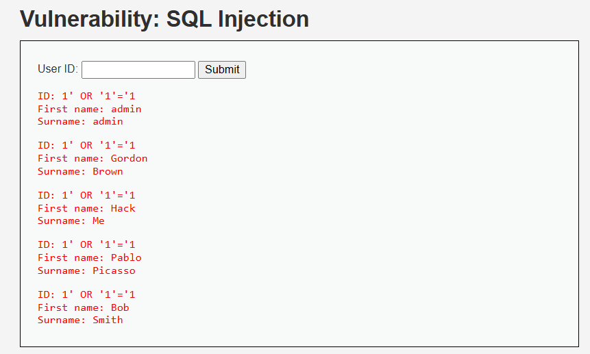

### Explanation of why it worked:
The application builds an SQL query using unsanitized user input. A typical query pattern is:

    SELECT first_name, last_name
    FROM users
    WHERE user_id = '$id';

When the payload is supplied, the logic becomes:

    WHERE user_id = '1' OR '1'='1'

Because `'1'='1'` is always true, the database returns **all rows**, so multiple users are shown.

### Explanation of why it failed at higher level:
At higher security levels (Medium/High), DVWA applies stricter input handling e.g., validation and safer query parameters. These controls prevent special characters like `'` from changing the SQL syntax, so the injected condition cannot modify the query logic and the attack fails.

### Security Level: 
Medium 🟢

### Payload:
```
1' OR '1'='1
```
##### Payload Source: OWASP Web Security Testing Guide

### Result:
The payload could not be injected because the application replaced the text input field with a dropdown menu containing predefined user IDs. When selecting `User ID = 1` and submitting, the application returned only the corresponding user record:

**First name:** admin  
**Surname:** admin  

### Screenshot:
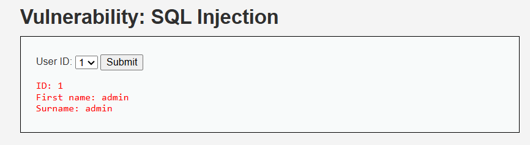

### Explanation of why it worked:
At the Medium security level, the application restricts user input by replacing the text field with a dropdown menu. This prevents users from entering arbitrary input containing special characters such as `'`, `OR`, or other SQL syntax.

Because the attacker cannot modify the input value, the SQL query cannot be manipulated.

### Explanation of why it failed at higher level:
Since the application restricts input to predefined values through the dropdown menu, it prevents malicious SQL payloads from being submitted. As a result, the attacker cannot alter the structure of the SQL query, and the injection attempt fails.

### Security Level:
High 🔴

### Payload:
```
1' OR '1'='1
```

##### Payload Source: OWASP Web Security Testing Guide

### Result:
The payload was entered in the SQL Injection session input window. However, unlike the Low security level, the application did not return multiple user records. Only a single record (admin) was shown.

### Screenshot:
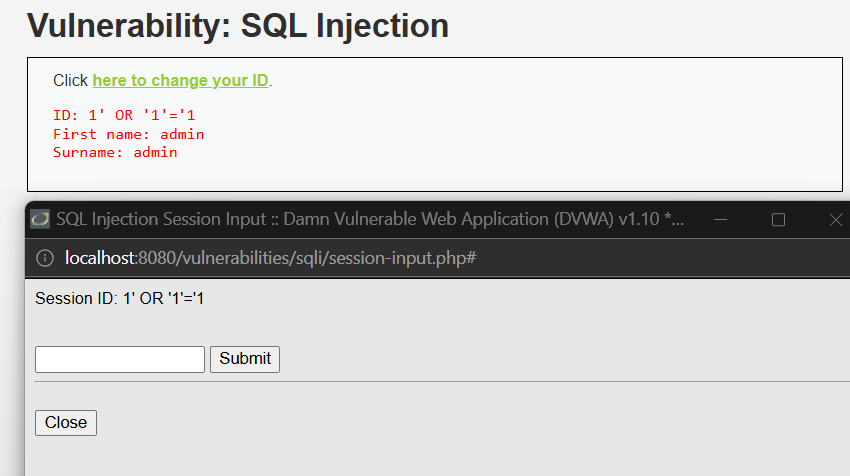

### Explanation of why it worked:
The payload tries to change the logic of the SQL query by adding the condition `'1'='1'`, which is always true. In systems that do not properly validate user input, this condition can cause the database to return all rows from the table.

### Explanation of why it failed at higher level:
At the High security level, DVWA applies stronger protections to user input. The application processes the input more carefully before using it in the SQL query, which prevents the injected condition from changing the query logic. Because of this, the attack does not return all users and only a normal result is shown.

## Command Injection

### Security Level: 
Low 🟡

### Payload:
```
127.0.0.1; id
```

##### Payload Source:  
Hackviser – Command Injection Testing Guide  
https://hackviser.com/tactics/pentesting/web/command-injection

### Result:
The application first executed the normal `ping` command and then also executed the `id` command. The output displayed:

```
uid=33(www-data) gid=33(www-data) groups=33(www-data)
```

This shows that the command was executed on the server.

### Screenshot:
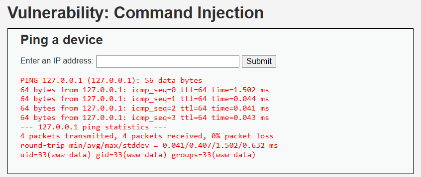

### Explanation of why it worked:
The application directly uses the user input in a system command. The semicolon (`;`) allows another command to run after the first one. Because there is no input validation, the server runs both `ping` and `id`.

### Explanation of why it failed at higher level:
At higher security levels, the application filters or blocks special characters like `;`. Because of this, additional commands cannot be executed.

### Security Level: 
Medium 🟢

### Payload:
```
127.0.0.1 | id
```

##### Payload Source:  
Hackviser – Command Injection Testing Guide  
https://hackviser.com/tactics/pentesting/web/command-injection

### Result:
After submitting the payload, the application executed the injected `id` command and displayed:

```
uid=33(www-data) gid=33(www-data) groups=33(www-data)
```

This shows that the command was executed by the web server process, confirming that command injection is still possible at the Medium security level.

### Screenshot:
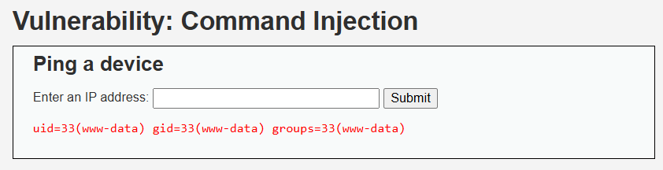

### Explanation of why it worked:
At the Medium level, the application blocks some characters such as `;`, but other command operators like `|` are still allowed. By using the pipe operator, the injected `id` command was executed by the system.

### Explanation of why it failed at higher level:
At the High security level, stricter input validation is applied and more command operators are filtered, preventing additional commands from being executed.

### Security Level: 
High 🔴

### Payload:
```
127.0.0.1; id
```

##### Payload Source:  
Hackviser – Command Injection Testing Guide  
https://hackviser.com/tactics/pentesting/web/command-injection

### Result:
After submitting the payload, the application only executed the normal `ping` command. The output of the `id` command was not displayed, indicating that the injected command was not executed.

### Screenshot:
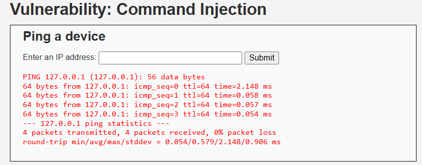

### Explanation of why it failed:
At the High security level, the application performs stricter input validation and filtering. Special characters such as `;` used to chain commands are blocked or ignored. As a result, only the intended `ping` command is executed.

### Explanation of mitigation:
The application restricts the input and filters dangerous characters before executing the system command. This prevents attackers from injecting additional commands into the system call.

## Cross-Site Request Forgery (CSRF)

### Security Level:
Low 🟡

### Payload:
```html
<html>
<body>

<form action="http://localhost:8080/vulnerabilities/csrf/" method="GET">
  <input type="hidden" name="password_new" value="hacked123">
  <input type="hidden" name="password_conf" value="hacked123">
  <input type="hidden" name="Change" value="Change">
</form>

<script>
document.forms[0].submit();
</script>

</body>
</html>
```

##### Payload Source:
Hackviser – CSRF Testing Guide  
https://hackviser.com/tactics/pentesting/web/csrf

### Result:
The malicious HTML page automatically submitted the request and the password was changed without the user pressing the **Change** button.

### Screenshot:
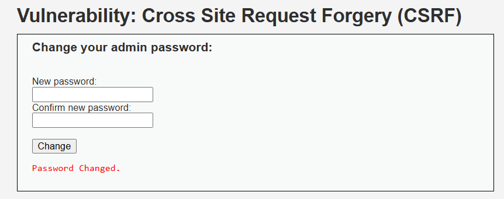

### Explanation of why it worked:
At the Low security level, DVWA does not verify the origin of the request. Since the user is already authenticated, the browser automatically sends the session cookie with the request, allowing the password change to occur.

### Explanation of why it failed at higher level:
At higher security levels, DVWA introduces protections such as checking the HTTP Referer header and using CSRF tokens. These mechanisms ensure that requests originate from legitimate pages, preventing the malicious request from being processed.

### Security Level:
Medium 🟢

### Payload:
```html
<html>
<body>

<form action="http://localhost:8080/vulnerabilities/csrf/" method="GET">
  <input type="hidden" name="password_new" value="hacked123">
  <input type="hidden" name="password_conf" value="hacked123">
  <input type="hidden" name="Change" value="Change">
</form>

<script>
document.forms[0].submit();
</script>

</body>
</html>
```

##### Payload Source:
Hackviser – CSRF Testing Guide  
https://hackviser.com/tactics/pentesting/web/csrf

### Result:
The attack failed and the application displayed the message:  
`That request didn't look correct.`

### Screenshot:
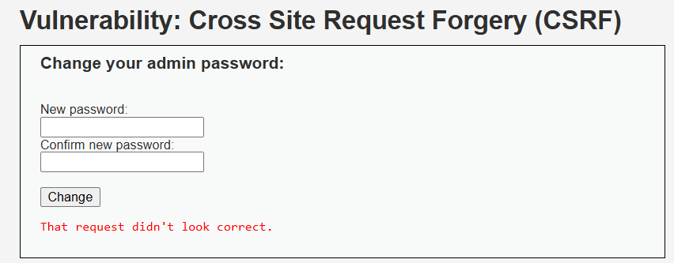

### Explanation of why it worked:
At the Low security level, the application does not verify the origin of the request. Since the victim is already authenticated, the browser automatically sends the session cookie with the request, allowing the password change to occur.

### Explanation of why it failed at higher level:
At the Medium security level, DVWA checks the HTTP Referer header to ensure that the request originates from the DVWA application. Since the malicious request came from an external HTML page, the server rejected the request.

### Security Level:
High 🔴

### Payload:
```html
<html>
<body>

<form action="http://localhost:8080/vulnerabilities/csrf/" method="GET">
  <input type="hidden" name="password_new" value="hacked123">
  <input type="hidden" name="password_conf" value="hacked123">
  <input type="hidden" name="Change" value="Change">
</form>

<script>
document.forms[0].submit();
</script>

</body>
</html>
```

##### Payload Source:
Hackviser – CSRF Testing Guide  
https://hackviser.com/tactics/pentesting/web/csrf

### Result:
The attack failed and the application displayed the message:  
`CSRF token is incorrect`.

### Screenshot:
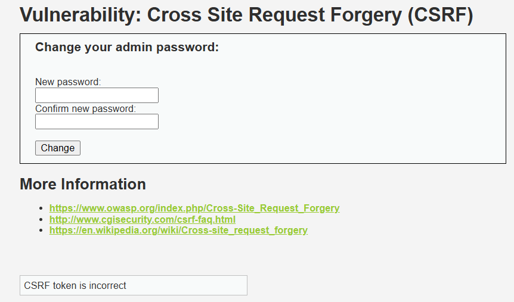

### Explanation of why it worked:
At the Low security level, the application does not verify the origin of the request, allowing the malicious request to change the password.

### Explanation of why it failed at higher level:
At the High security level, DVWA requires a valid CSRF token to be included in the request. Since the malicious HTML page does not contain the correct token generated by the application, the request is rejected.

## File Inclusion

### Security Level:
Low 🟡

### Payload:
```
../../../../../etc/passwd
```

##### Payload Source:  
Hackviser – File Inclusion Testing Guide  
https://hackviser.com/tactics/pentesting/web/local-file-inclusion

### Result:
The application displayed the contents of the system file `/etc/passwd`, confirming that Local File Inclusion was possible.

### Screenshot:
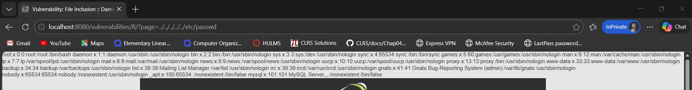

### Explanation of why it worked:
At the Low security level, the application directly includes the value provided in the `page` parameter without validating or sanitizing it. This allows an attacker to perform directory traversal and access sensitive files on the server.

### Explanation of why it failed at higher level:
At higher security levels, DVWA restricts file inclusion to specific allowed files and sanitizes user input, preventing directory traversal attacks.

### Security Level:
Medium 🟢

### Payload:
```
..//..//..//..//etc/passwd
```

##### Payload Source:
Hackviser – File Inclusion Testing Guide  
https://hackviser.com/tactics/pentesting/web/local-file-inclusion

### Result:
The application displayed the contents of `/etc/passwd`, confirming that the directory traversal filter was bypassed.

### Screenshot:
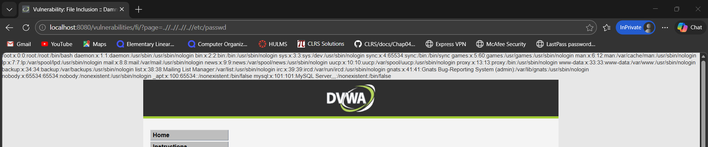

### Explanation of why it worked:
At the Medium security level, the application attempts to block directory traversal by filtering the string `../`. However, the payload `..//` bypasses this filter while still resolving to a parent directory, allowing access to sensitive system files.

### Explanation of why it failed at higher level:
At higher security levels, DVWA restricts file inclusion to a predefined set of files and performs stricter input validation, preventing directory traversal attacks.

### Security Level:
High 🔴

### Payload:
```
file:///var/www/html/hackable/flags/fi.php
```

##### Payload Source:
Hackviser – File Inclusion Testing Guide  
https://hackviser.com/tactics/pentesting/web/local-file-inclusion

### Result:
The application displayed the contents of the file `/var/www/html/hackable/flags/fi.php`, confirming that file inclusion was still possible.

### Screenshot:
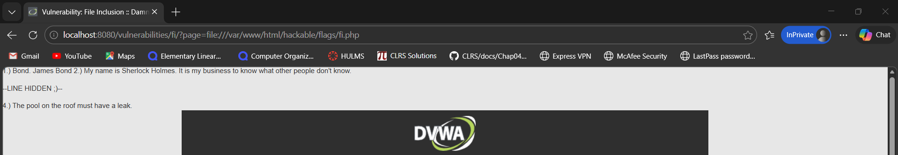

### Explanation of why it worked:
Although the High security level attempts to restrict file inclusion to specific filenames, the filter does not block PHP stream wrappers such as `file://`. This allows attackers to directly reference files on the server and bypass the intended restrictions.

### Explanation of why it failed at higher level:
Stronger implementations should strictly validate allowed file paths and disable dangerous wrappers such as `file://`, preventing arbitrary file inclusion.
